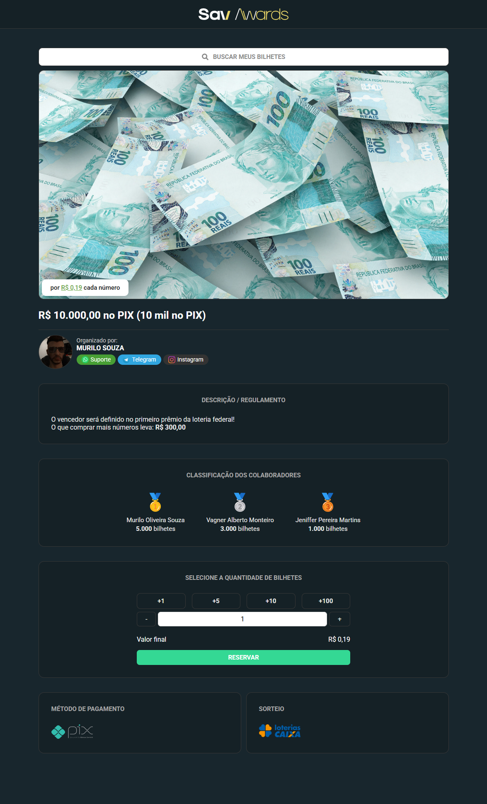

# 🎟️ Savawards Templates — Plataforma de Rifas Online

**Savawards Templates** é um template **front-end moderno e responsivo** para a criação de uma **plataforma de rifas online**. Ideal para desenvolvedores que desejam acelerar o processo de desenvolvimento de uma aplicação de sorteios digitais com uma base sólida e personalizável.

[🔗 Visualizar Site de Rifas Online](https://murilosav.github.io/savawards-templates/) 

[🔗 Visualizar Dashboard Administrativa](https://murilosav.github.io/savawards-templates/admin_dashboard/dashboard-admin.html)

---

## 🚀 Recursos Principais

- 🎨 **Interface Responsiva e Moderna**  
- ⚙️ **Componentes Reutilizáveis** prontos para integração com back-end  
- 📦 Estrutura de diretórios organizada  
- 🌐 Fácil de personalizar para sua marca ou negócio  
- 💡 Ideal para projetos com sorteios, rifas, vendas de bilhetes e eventos promocionais  

---

## 🛠️ Como Usar

1. Clone o repositório:
   ```bash
   git clone https://github.com/murilosav/savawards-templates.git
   ```

2. Abra o arquivo `index.html` no seu navegador ou edite com seu editor favorito.

3. Customize os componentes e estilos conforme necessário.

4. Integre com seu **back-end favorito** (Django, Laravel, Node.js, Firebase, etc.)

---

## 🧩 Casos de Uso

- Plataformas de rifas beneficentes  
- Sorteios online com prêmios físicos ou digitais  
- Venda de bilhetes para eventos promocionais  
- Landing pages para campanhas de engajamento  

---

## 📸 Captura de Tela



---

## 🤝 Contribuições

Contribuições são bem-vindas! Sinta-se livre para abrir *issues* ou *pull requests* com melhorias ou correções.

---

## 📄 Licença

Este projeto está licenciado sob a **MIT License**.